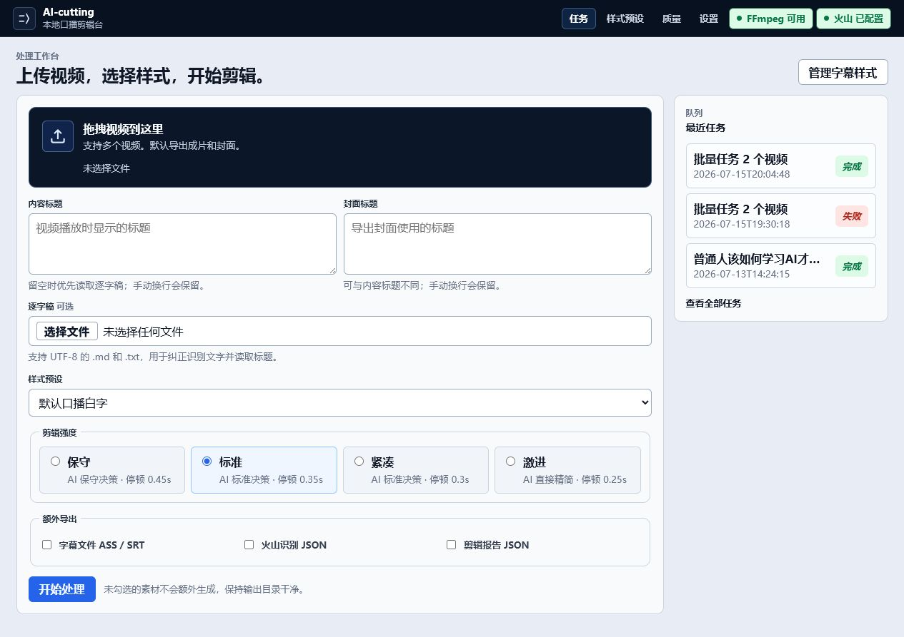
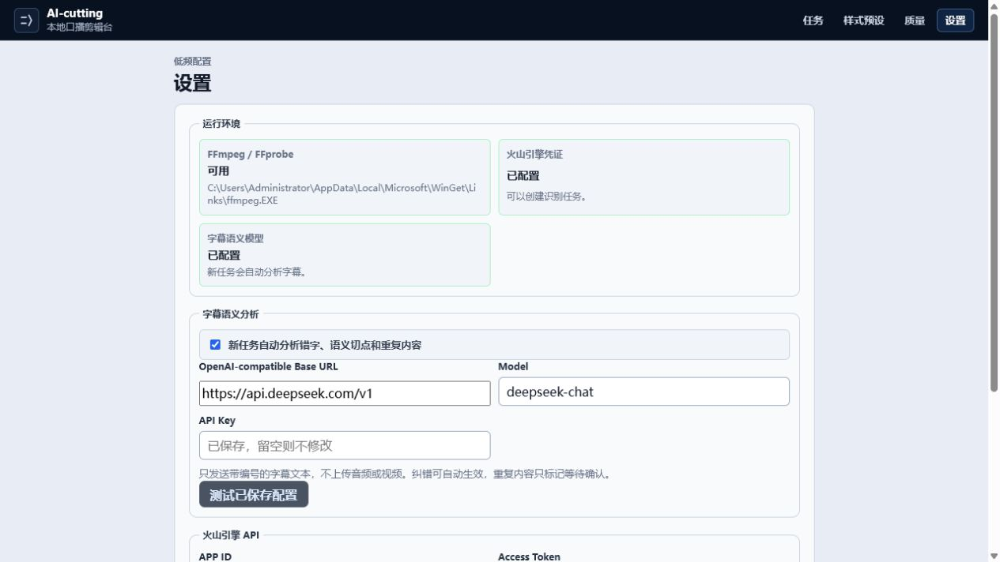
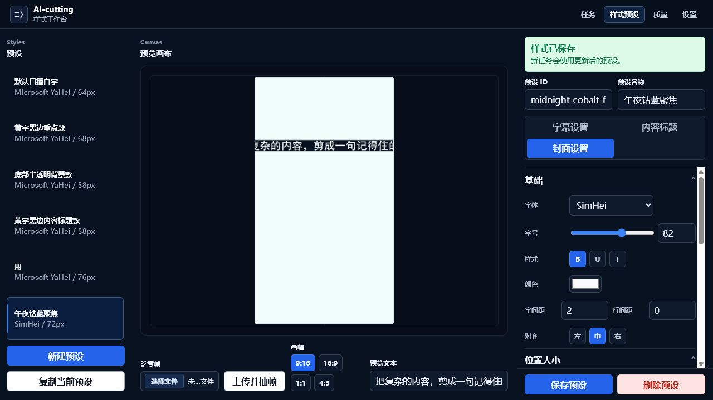
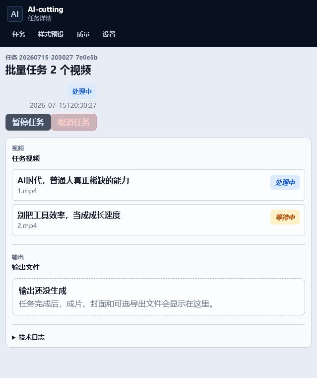
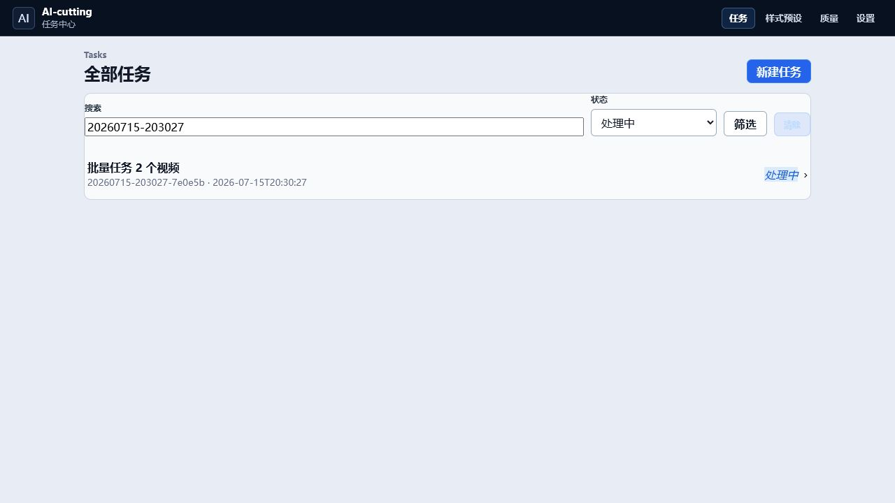
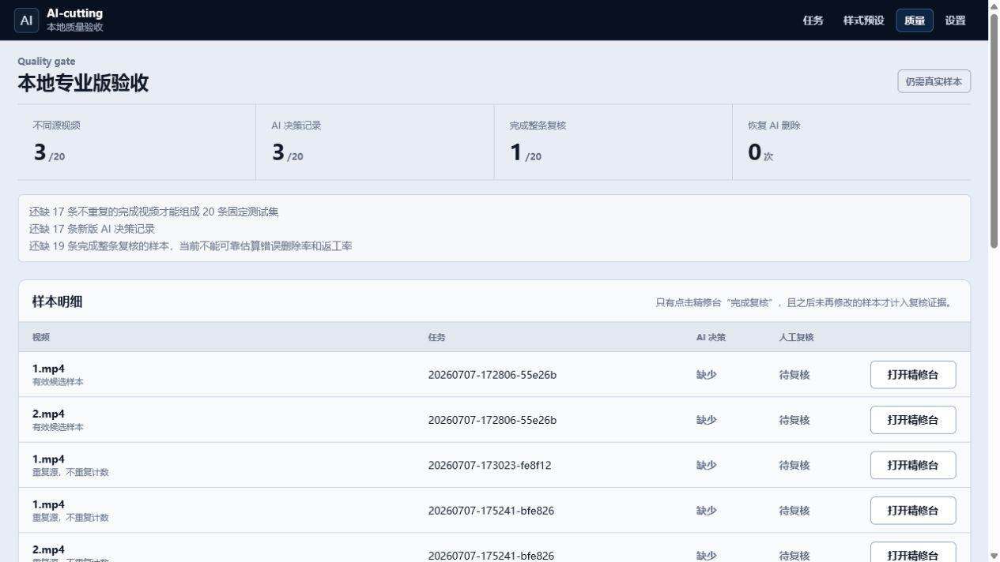
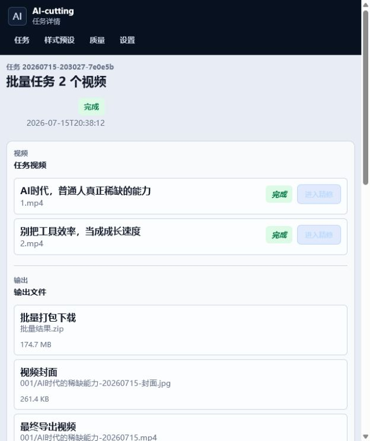
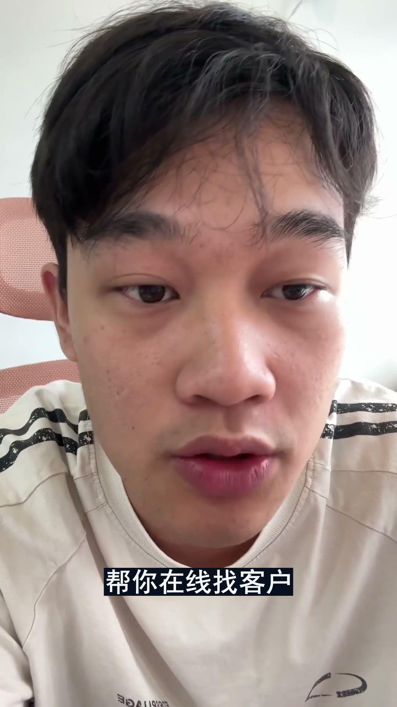
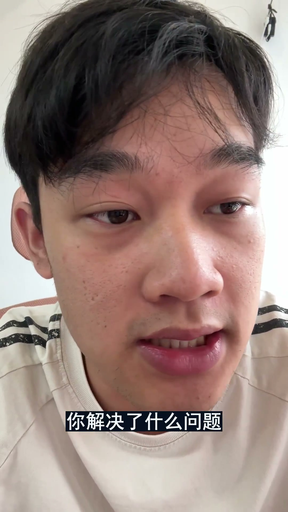
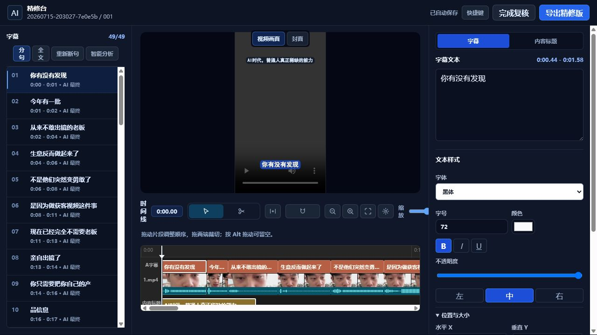

# AI-cutting 全流程体验与审计报告

审计日期：2026-07-15
审计范围：本地 Web 产品从配置、预设、批量任务、暂停恢复、结果、任务中心、质量验收、精修台到回归检查。
测试素材：`input/1.mp4`、`input/2.mp4`。
测试任务：`20260715-203027-7e0e5b`。
特别预设：`midnight-cobalt-focus` / “午夜钴蓝聚焦”。

## 结论

产品已经具备“能完成真实工作”的骨架：两条视频成功出片，暂停/恢复检查点可靠，结果文件齐全，精修台的搜索、联动和自动保存有效，完整回归检查全部通过。

但它目前更像一款工程能力很强的内部工具，而不是一个可以放心交给非技术创作者的成熟产品。最关键的问题不是按钮颜色，而是三个“信任断点”：

1. 上传在内置浏览器环境中没有可接管的文件选择器，也没有失败反馈，本次只能用本地 `/jobs` 接口注入素材。
2. 预设页的“精确预览”会裁掉长文字，且不能可靠预示最终封面位置和构图。
3. 语义模型开启后仍留下明显错字、词组拆断和重复语义，成片不能直接发布，必须进精修台人工检查。

审美结论：**6.4/10**。界面克制、工具感正确，但多个页面仍有后台表单感；成片封面和字幕的视觉处理缺乏对人物画面的构图判断。
技术审计：**12/20，Acceptable（可用，但仍需明显改进）**。

## 实际产出

| 项目 | 原始时长 | 成片时长 | 删除时长 | 规格 | 文件大小 |
|---|---:|---:|---:|---|---:|
| 001 | 100.872s | 92.160s | 8.722s | 1080×1920 / H.264 + AAC / 60fps | 84.3 MB |
| 002 | 106.105s | 98.005s | 8.115s | 1080×1920 / H.264 + AAC / 60fps | 89.9 MB |

批量 ZIP：174.7 MB。上传 312 MB 本地素材到 `/jobs` 用时约 6.6 秒。总流程用时 7 分 59 秒，其中包含一次暂停与恢复测试。

## 流程记录

### 1. 首页空状态 — 一般

优点：任务入口明确；运行环境状态直接显示；核心选项集中在一个页面。
问题：首页仍然很像“表单 + 右侧最近任务”的后台页，预览不是任务创建阶段的视觉主角。旧失败任务长期占据最近任务，会降低新用户信心。

### 2. 设置与运行环境 — 良好

- FFmpeg / FFprobe 可用。
- 火山引擎 ASR 已配置。
- DeepSeek `deepseek-chat` 已启用，且本地配置中存在非空 API Key（仅核验存在性与长度，没有回显密钥）。该 Key 在本轮测试开始前已经保存在项目中，并非本轮新申请或新填写。
- 模型连通测试约 1.5 秒，结果“模型连接正常”。任务产物进一步证明并非“未配置时静默走本地算法”：视频 001 对 `api.deepseek.com` 发起 19 次未命中缓存的请求，消耗 49,305 tokens；视频 002 发起 21 次，消耗 49,636 tokens。产物中保留了 provider、model、请求延迟、token usage、`cache_hit: false` 与决策轨迹，但不包含 API Key。

优点：密钥不回显；环境自检清晰；对“只发送字幕文本、不上传音视频”的说明增加信任。
问题：`OpenAI-compatible Base URL` 和其他中文字段混用；URL 输入没有进入统一输入与 focus 样式选择器；运行环境卡片仍偏内部诊断面板。

### 3. 新建特别预设 — 较差

创建了“午夜钴蓝聚焦”：黑体、白字、钴蓝背景、轻描边；内容标题只在开头 3.5 秒显示；封面使用更大的白字钴蓝底。

关键问题：

- 点击“新建预设”立即落盘，用户尚未命名就生成一个“新建预设”，容易累积垃圾预设。
- 左侧已有名为“用”的预设，产品没有阻止低质量命名。
- “Styles / Canvas / Scale X / Scale Y”混入中文界面。
- 预览中的长标题被横向裁切；白色空画布与实际视频背景差异巨大。
- 最终封面标题压在人物额头上，说明预览不能承担“结果可信”的职责。

### 4. 批量任务创建与运行 — 一般

内置浏览器点击上传后没有出现可被自动化接管的系统文件选择器，页面也没有提示。本次仅将文件注入改走项目自己的本地 `/jobs` 接口；任务创建后的全部观察继续使用内置浏览器。

任务页能表达两个视频的排队顺序，但只有“处理中 / 等待中”，没有：

- 当前阶段（上传、ASR、语义分析、剪切、烧字幕、打包）；
- 百分比或已完成步骤；
- 当前视频耗时；
- 预计剩余时间；
- “安全暂停要等当前步骤结束”的预计等待说明。

对于近 8 分钟的任务，这不是小瑕疵，而是信任问题。

### 5. 暂停与继续 — 良好

- 发出暂停请求后约 21 秒进入安全暂停。
- 日志显示停在 `video_cut` 阶段结束后的检查点。
- 点击继续约 1.1 秒恢复运行。
- ASR、分析、对齐、布局和剪切等已有检查点均被复用，没有从头重跑。

这是本轮技术表现最好的部分：状态机、检查点与恢复语义一致，实际行为和界面文案相符。

### 6. 任务中心筛选 — 良好但不耐规模

搜索与状态筛选有效，清除筛选也存在。
问题：默认直接渲染全部历史任务，没有分页、虚拟化、时间分组或归档；历史测试数据和失败任务混在真实内容里。任务多后扫描成本明显上升。

### 7. 质量验收页 — 技术诚实，产品定位混乱

优点：明确承认样本不足，不伪造质量结论；能追踪不重复源视频、AI 决策、人工复核与恢复删除。
问题：这是一页开发/QA 工具，却放在创作者主导航的“质量”中。“20 条固定测试集”“错误删除率和返工率”不是普通创作者的任务语言。建议移入开发者模式或诊断区，创作者侧改为“本条视频需要复核的风险”。

### 8. 双视频完成页 — 成功但信息组织弱

优点：两条视频均成功；成片、封面、ASS、SRT、ASR JSON、报告和批量 ZIP 全部生成。
问题：输出是一个扁平长列表，第二条视频的报告/字幕先出现，封面/视频后出现。建议按视频分组，每组把“成片 + 封面”作为主结果，技术文件折叠为“更多导出”。

### 9. 成片视觉 — 可读，但还不够好看

字幕可读性高，描边和背景能压住复杂画面。但字号和底色都过重，画面已经被人物大特写占满，字幕再次用大块矩形抢视觉中心，整体更像“能看清”而不是“精致”。

两张自动封面的问题更明显：

- 文案直接压在额头上，破坏人物面部焦点；
- 取帧没有避开顶部电线、脸部过近和表情普通的画面；
- 同一套构图机械复制到两条视频，没有根据脸部位置自适应；
- 预设页没有用真实参考帧完成最终构图确认。

建议封面生成增加人脸/眼睛安全区、显著物体检测、多个候选帧和一键换帧。标题位置应该由构图安全区决定，而不是固定坐标。

### 10. 精修台 — 核心强，认知负荷高

实测：

- 首次进入约 0.7 秒，随后后台更新无缝预览；
- 搜索“ai货客系统”能定位到第 29 条；
- 点击时间线字幕会同步播放头、预览与右侧编辑器；
- 实际修改为“AI获客系统”；
- 约 3.7 秒后显示“已自动保存”；
- 快捷键面板内容完整。

优点：左句子列表、中视频/时间线、右属性面板的结构是正确的剪辑工具结构；功能密度高但基本可理解。
问题：

- 同一字幕同时在左列表和时间线暴露为可交互项，屏幕阅读器会遇到大量重复按钮。
- 快捷键面板没有 `role="dialog"` / `aria-modal` 语义，未验证焦点陷阱与关闭后焦点返回。
- 预览面积偏小，三个区域争抢空间；右侧面板需要长滚动。
- 顶部“完成复核”过于靠近“导出精修版”，但没有明确复核标准与未处理风险计数。
- 搜索命中时仍保留所有时间线按钮，DOM 规模并未随过滤缩小。

## 字幕与语义质量

DeepSeek 语义分析已开启且确实发生了网络调用，但“调用成功”不等于所有结果都被采用：视频 001 有 2 个布局片段、视频 002 有 3 个布局片段因 AI 返回的 token 序列未通过连续性校验而回退到本地布局。当前产品界面没有把这种局部回退暴露给用户，任务仍整体显示成功。

第一条视频仍存在明显问题：

- `ai货客系统`，应为“AI获客系统”（已在精修项目中修正，原始成片未重导出）。
- `你只需要把你自己的产 / 品信息`，词组被错误拆开。
- `重塑了他们的获客体 / 系我们有五个`，语义边界错误。
- `在广` 成为独立短句，接着又出现“我们在广西做获客系统”。
- `每条视频左上角 / 每条视频左下 / 角挂上你的企业微信`，明显含重复识别或口误未完成语义清理。
- `每天几十个精准进线 / 每天几十个精准客资进来`，可能是重复表达，但自动决策未处理。

系统只把 2 条过长字幕标成建议/语义风险，漏掉了以上更明显的错字、断词和重复。这说明“像素宽度规则”比“语言正确性规则”更成熟，也说明目前的成功状态只能证明流水线完成，不能证明 AI 语义质量达到了无需人工复核的发布标准。

### DeepSeek 语义链路专项复盘

本项目的目标是成片无需人工调整。按这个标准，本轮虽然真实使用了 DeepSeek，但语义自动化尚未达标：两条视频的 AI 自动纠错均为 0，真正应用的 AI 删词也均为 0；当前成片中出现的错误不是人工漏审，而是自动链路没有发现、没有采纳或错误断开。

| 视频 | 语义分析分块 | 本任务实时语义请求 | 复用语义缓存 | AI 纠错 | 删除候选 / 实际删除 | AI 布局 / 本地回退 |
|---|---:|---:|---:|---:|---:|---:|
| 001 | 5 | 0 | 5 | 0 | 1 / 0 | 15 / 2 |
| 002 | 5 | 1 | 4 | 0 | 0 / 0 | 14 / 3 |

缓存来自相同输入和同一提示词版本的历史 DeepSeek 成功响应，复用本身没有问题；但应区分“本任务实时调用”和“复用 AI 决策”。本轮此前统计的 19/21 次未命中缓存请求包含字幕布局等调用，不能全部表述成逐字稿语义分析调用。

#### 错误到底从哪里产生

1. **ASR 原始识别错误没有被第二阶段纠正。** 火山 ASR 已直接输出 `循盘`、`ai全列入搞定`、`挂载起微`、`三秒加吼` 等错误文本。当前没有提供逐字稿，`transcript_alignment_status=skipped / missing_transcript`，因此只能依赖 DeepSeek 文本纠错；但两条视频的 `corrections` 都为空。DeepSeek 是文本模型，只看到 ASR 文字和时间，听不到原音；没有热词、候选词、ASR 置信度和业务词库时，它无法稳定恢复所有同音词。
2. **语义提示词职责过载。** 一次请求同时要求输出纠错、断点、允许断点、禁止断点、保护片段、重复候选、删除区间和最终句子八类结果。每块最多 100 tokens，模型倾向于生成大量断点和句子结构，却没有稳定完成纠错与删词。本轮 001/002 的纠错数量均为 0，002 连明显的连续重复“你点一下试试看”也没有提出删除。
3. **100-token 分块没有重叠上下文。** 001 中“每条视频左上角”落在第 2 块，“每条视频左下角……”落在第 3 块；“左下角企业微信每天”与后面的“每天几十个……”也横跨第 4/5 块。跨块重复和半句重启天然难以被发现。
4. **正确的假起始删除被本地校验器否决。** DeepSeek 对 001 的“在广”给出 `false_start`、置信度 0.95；但本地 `_delete_evidence()` 只接受“删除文本必须是右侧文本的开头”。右侧实际是“我们在广西……”，因为多了“我们”而被标记 `restart_prefix_not_found`。这与提示词中“在广……我们在广西”的正例直接矛盾。
5. **没有中文词组级硬保护，像素宽度可以压过语义。** “你只需要把你自己的产品信息”在语义分析中本是完整句，但模型没有把“产品信息”列入 `forbidden_breaks`；布局候选受硬宽度限制后，DeepSeek 选择了“产 / 品信息”。同类问题还有“获客体 / 系”。目前只有模型主动枚举的词组受到保护，没有词典分词、实体识别或孤字规则作为确定性底线。
6. **语义分析结果缺少严格校验与重试。** 001 的 `final_sentences` 把 token 拼接得到的“重塑了他们的获客体系”声明为“重塑了他们的获客体”；`forbidden_breaks` 也存在同样的 text/token 不一致。清洗函数仍把响应记为 `status=ok`，下游只是静默忽略无效 span，最终允许在“体 / 系”之间断开。
7. **布局模型的信息表达不利于可靠选择。** 模型看到 token 文本，但 `line_options` 只给 `id/start/end/fill/natural`，不直接给每个候选的文本；它需要自行映射索引。输出只要覆盖 token 且不超宽就能通过校验，即使是“产 / 品信息”“最关键 / 的一步”这种语言上明显错误的结果也会被标为“AI 最终”。
8. **局部回退和语义失败没有进入产品成功条件。** 两条视频分别有 2、3 个布局片段回退，但任务页仍只显示“完成”。精修台也主要暴露像素过长风险，没有展示纠错为 0、删除为 0、无效语义 span、回退片段和低可信 ASR 词。

#### 达到“无需人工调整”的优化顺序

**P0：把一个大模型任务拆成四个可验证阶段。**

1. ASR 纠错：只做错别字、同音词、英文大小写和专有词；输入业务词典、标题、上下文、ASR 置信度与候选词。优先启用火山热词/自定义词表；文本模型无法听清时，可对低置信片段交给能接收音频的二次识别模型。
2. 删词与口误：单独检测结巴、假起始、精确重复和语义重复。先高召回产生候选，再用第二次模型调用或确定性验证器做高精度裁决；不要简单降低阈值直接删视频。
3. 语义句与不可拆词组：先输出完整句和词组 span，并对 token 连续性、拼接文本、覆盖率做严格 schema 校验；失败必须带错误重试，不能静默忽略。
4. 像素布局：只在已经通过语义校验的合法边界中选行；候选中直接携带文本，禁止模型重新推算索引。

**P0：修复当前确定性缺陷。**

- 修改 `false_start` 证据规则：允许右侧前 2–4 个字出现主语后再重现被删除片段，并结合停顿、相邻位置和模型置信度判断；本例“在广 / 我们在广西”必须通过。
- 对每个 DeepSeek 返回的 token span 做存在、连续、顺序、文本一致性和覆盖率校验；把校验错误送回模型重试。重试仍失败则自动换更强模型或重新分块，不能把任务标成完全成功。
- 加入确定性的中文词组保护：业务词典 + 通用分词/实体识别 + 数字单位 + 英文词 + 同一 ASR word 内字符。最少保证“产品信息、获客体系、企业微信、左下角”等词组不可从中间拆开。
- 加入孤字和残句校验：行首为“的、了、系、品、角”等单字承接，或行尾留下明显未完成词根时，布局直接判无效并重试。

**P1：修复分块和上下文。**

- 语义分析块增加 20–30 tokens 重叠，并在合并时按 token ID 去重；删除检测必须额外检查块边界两侧。
- 不要把 ASR 的 `words_per_line=15` 展示分段当作语义边界；先按时间连续性合并，再由语义模型确定句子。
- 把标题、内容主题、前后 1–2 句和领域词表加入每块上下文，减少 `获客/货客`、`企微/起微` 等领域词误判。

**P1：重做自动质量门。**

当前质量页只有 3/20 个不同源视频、4/20 条 AI 决策记录、1/20 条完整复核，系统自己也显示“当前不能可靠估算错误删除率和返工率”。生产阶段可以无人值守，但研发验收必须先建立人工标注金标准。至少统计：字符错误率、专有词准确率、断句边界 precision/recall、词中断开次数、删除 precision/recall、错误删除时长、残留口误数量以及无需修改即可发布率。

建议发布门槛：词中断开为 0；关键名词错误为 0；错误删除为 0；语义布局无回退或回退已通过同等校验；固定测试集“无需修改即可发布率”达到约定目标后，才允许界面显示“自动完成”。否则系统应自动重试、切换模型或进入机器复核队列，而不是把检查责任交给用户。

## 技术审计评分

| # | 维度 | 分数 | 关键结论 |
|---|---|---:|---|
| 1 | Accessibility | 2/4 | 有标签和 focus 基础，但对比度、30px 触控目标、快捷键面板语义与重复控件仍有明显缺口 |
| 2 | Performance | 3/4 | 本地上传与编辑器快，检查点恢复优秀；成片体积偏大、长任务缺少可观察性 |
| 3 | Responsive Design | 2/4 | 有响应式 CSS，但 30px 导航目标不适合触控；本轮浏览器视口覆盖未改变 CSS 布局宽度，不能声称移动端已完整验证 |
| 4 | Theming | 2/4 | 有 34 个 token，但 CSS 仍有 236 处十六进制颜色、135 个不同色值，编辑器主题难以系统维护 |
| 5 | Anti-Patterns | 3/4 | 自动检测无 AI 套路命中，整体克制；仍有卡片堆叠、后台表单感和中英 kicker 混用 |
| **总计** |  | **12/20** | **Acceptable：可完成任务，但发布前仍需解决关键体验与质量信任问题** |

### 反 AI 套路结论

**通过，但不是满分。** 没有渐变字、玻璃拟态、巨大圆角、装饰性动画或营销模板。项目自带 Impeccable detector 返回 `[]`。真正的问题不是“像 AI 生成的页面”，而是“像内部管理工具”：边框面板多、表单权重高、预览与结果信任不足。

## 详细问题清单

### P1 — 发布前应解决

1. **预设精确预览会裁文字且不等于最终结果**
   位置：`web/templates/style_presets.html`，`web/app.py` 的 `_preview_ass`，以及 ASS `WrapStyle: 2` / `\q2` 路径。
   影响：用户保存了看似合理的样式，最终封面却把标题压在额头上。
   建议：预览必须使用真实参考帧；采用与最终导出完全一致的换行、坐标和安全区算法；长文本超界时阻止保存或明确报错。
   建议命令：`$impeccable harden`。

2. **任务进度不可解释**
   位置：`web/templates/job.html:33` 附近只展示任务 status。
   影响：8 分钟任务中用户不知道是在 ASR、剪切还是渲染，也不知道暂停为什么要等 21 秒。
   建议：展示阶段、步骤清单、单条视频进度、已耗时和粗略 ETA；暂停时显示“将在当前阶段结束后暂停”。
   建议命令：`$impeccable clarify`。

3. **字幕语义质量未达到可直接发布**
   位置：ASR + LLM 分析 + 断句规则，精修台第 9/10、24/25、26–33、38、41–43 条可见。
   影响：错字、断词和重复会直接烧录进成片，用户若不逐条复核就会发布错误内容。
   建议：增加断词词典、相邻句语义合并、重复片段候选、专有词纠错和“必须复核”风险队列；把置信度与原因带入精修台。
   建议命令：`$impeccable harden`。

4. **封面没有构图感知**
   位置：封面自动取帧与标题布局。
   影响：两条封面都把标题压在人脸额头上，且保留顶部电线等杂物，结果不够专业。
   建议：做人脸/眼睛安全区、显著物检测、多候选帧打分与换帧；标题位置随人脸重心调整。
   建议命令：`$impeccable polish`。

5. **小号文字在应用背景上对比不足**
   位置：`web/static/style.css:23`，`#667085` 对 `#e8edf5` 实测约 **4.23:1**。
   标准：WCAG 1.4.3（普通文本 4.5:1）。
   影响：12px kicker、帮助文字和次要信息对低视力用户偏淡。
   建议：提升 muted 文本亮度差，或限制它只在更浅 surface 上使用。
   建议命令：`$impeccable colorize`。

6. **主要导航与多个工具按钮仅 30px 高**
   位置：`web/static/style.css:154-161` 及多个 editor tool 样式。
   标准：WCAG 2.5.8 的 24px 最低线可满足，但移动端产品目标应采用约 44px 的触控目标。
   影响：窄屏和触控设备误触概率高。
   建议：视觉高度可以保持紧凑，但用 padding/伪元素扩大命中区，移动端至少 44px。
   建议命令：`$impeccable adapt`。

### P2 — 下一轮应解决

7. **上传失败/文件选择器不可用时无反馈**
   影响：本轮内置浏览器点击后页面仍显示“未选择文件”，没有解释或恢复路径。
   建议：监听 chooser cancel/无文件状态；提供明确提示与“重试选择”；可考虑本地文件路径导入作为桌面环境后备。
   建议命令：`$impeccable harden`。

8. **任务列表没有分页与归档**
   位置：`web/templates/jobs.html:52` 直接遍历全部任务。
   影响：测试数据、失败数据和真实任务混在一起，列表会无限增长。
   建议：默认 20 条分页，增加日期分组、归档和“只看真实任务”。
   建议命令：`$impeccable distill`。

9. **输出文件未按视频和重要性分组**
   位置：`web/templates/job.html:88` 与 `web/app.py:3440` 的 `rglob` 收集。
   影响：用户要在 JSON、ASS、SRT 中寻找真正的成片和封面。
   建议：每条视频一个结果组，成片/封面置顶，技术文件折叠；批量 ZIP 单独置顶。
   建议命令：`$impeccable layout`。

10. **精修台快捷键面板缺少对话框语义**
    位置：`web/templates/edit.html:39-44`。
    影响：读屏用户不知道已进入浮层；焦点陷阱和关闭后焦点返回未得到保证。
    建议：使用原生 `<dialog>` 或补 `role="dialog"`、`aria-modal`、标题关联、焦点管理与 Escape。
    建议命令：`$impeccable harden`。

11. **颜色系统漂移**
    位置：`web/static/style.css`。
    证据：34 个 token，138 次 token 使用；但仍有 236 个十六进制色值出现、135 个不同色值。
    影响：状态、边框、编辑器深色区难以一致迭代，未来主题切换成本高。
    建议：收敛 surface、line、text、accent、semantic 和 editor-layer token。
    建议命令：`$impeccable document`。

12. **输出规格偏重**
    证据：两条约 1.5 分钟成片分别 84.3/89.9 MB，约 7.67/7.69 Mbps，60fps。
    影响：移动端上传、分发和云存储成本高。
    建议：提供“平台发布 / 高质量母版”两档；平台档允许 30fps 与更低码率，默认显示预计体积。
    建议命令：`$impeccable optimize`。

13. **URL 输入未进入统一控件样式**
    位置：`web/static/style.css:552` 与 `:585` 的输入选择器未包含 `input[type="url"]`。
    影响：设置页 Base URL 与其他输入的边框、focus 和密度不一致。
    建议：纳入统一控件与 focus-visible 样式。
    建议命令：`$impeccable polish`。

### P3 — 视觉与文案精修

14. **中英界面混杂**：`Tasks`、`Styles`、`Canvas`、`Quality gate`、`Scale X/Y`。建议统一为创作者中文，内部术语进入高级设置。
15. **过多面板边框**：首页、任务页、设置页都依赖白色 surface + 1px 边框划区，虽然克制，但仍有后台系统感。
16. **新建预设立即落盘**：建议先进入草稿态，用户保存后再出现在列表，避免“新建预设”“用”这类垃圾项。

## 系统性问题

1. **预览不是唯一真相**：预设页、编辑器预览、最终 ASS 和封面生成之间仍存在认知差异。
2. **工程状态比用户状态丰富**：日志和检查点非常完整，但页面只给“处理中”。
3. **视觉规则缺少内容感知**：固定坐标能稳定出片，却不会判断人脸、眼睛、杂物和画面重心。
4. **像素规则强于语言规则**：系统能判断文字是否超宽，却不能稳定发现断词、错字和相邻重复。
5. **内部 QA 暴露在主产品**：质量验收页很有价值，但不应与普通创作者任务混在同一级导航。

## 做得好的部分

- 暂停、检查点、继续和服务恢复路径真实可用。
- 两条视频均成功生成完整结果，没有半成品或丢文件。
- 设置页不回显密钥，跟踪文件密钥扫描通过。
- 错误边界覆盖了空请求、坏 JSON、坏渲染/分析请求。
- 精修台结构符合视频工具认知，搜索、时间线联动和自动保存可靠。
- 动效克制，存在 `prefers-reduced-motion` 处理。
- 没有明显 AI 视觉套路；Impeccable detector 返回空结果。
- 完整回归：Python compile、编码、密钥、原子 JSON、启动器、时间线、逐字稿、对齐、暂停、恢复、质量报告、训练导出、字幕智能、错误边界、编辑页 JS、Impeccable 与 whitespace 全部通过。

## 推荐行动顺序

1. **[P1] `$impeccable harden`**：统一预览与最终渲染，增加字幕语言风险队列和上传失败反馈。
2. **[P1] `$impeccable clarify`**：补齐任务阶段、进度、耗时、ETA 与安全暂停说明。
3. **[P1] `$impeccable polish`**：加入人脸安全区、候选封面帧和结果页信息分组。
4. **[P1] `$impeccable adapt`**：扩大移动端触控目标，完成真实移动端与 200% zoom 验证。
5. **[P2] `$impeccable document`**：收敛 135 个硬编码颜色，建立编辑器深浅主题 token。
6. **[P2] `$impeccable optimize`**：提供 30fps/平台码率导出档，降低分发体积。
7. **[P2] `$impeccable polish`**：最终统一中英文、focus、对话框语义与页面密度。

你可以让我按顺序一次执行一项，也可以一次完成全部修复；修复后应重新运行 `$impeccable audit` 对比分数。

## 证据限制

- 内置浏览器的视口覆盖在本轮没有改变 CSS 布局宽度，只裁切了截图，因此 `07-home-mobile-390.png` 与 `12-editor-mobile-390.png` 被视为拒收证据，不用于移动端结论。
- 截图不能证明完整 WCAG 合规；键盘顺序、读屏、焦点陷阱与 200% zoom 仍需专项测试。
- 本轮没有逐帧、逐句完整观看 190 秒成片；视觉结论基于封面、30 秒帧、编辑器预览、字幕文本与输出报告。
- 为保持最终成片仍为两条，只在精修项目中修正一处字幕，没有再次导出精修版；两条原始成片不包含该修正。

## 修复进展（2026-07-16，取代上方旧结论）

本节记录本轮按“无人精修、质量门不过不得发布”的实施结果。状态只按实际证据填写；仅写完代码但未通过固定样本验收的项目不会标记为完成。

DeepSeek 已确认不是“未配置但静默成功”：设置页保存了非空 Key，内置浏览器点击“测试已保存配置”返回“模型连接正常”；真实任务的 `ai_decisions.json` 记录 `provider=api.deepseek.com`、`model=deepseek-chat`、调用延迟、token usage、缓存命中和四阶段决策轨迹，且不包含 Key。当前流水线依次执行纠错、删词候选、独立删除复核、语义句/不可拆词组，再做像素布局。单视频任务 `20260715-232628-c81427` 已在质量门通过后完成，不再把本地回退冒充“AI 最终”。

| # | 原问题 | 当前状态 | 修复与证据 |
|---:|---|---|---|
| 1 | 预设预览不等于最终渲染 | **部分完成** | 标题换行、字体测量、ASS/封面布局已复用同一布局服务；预设精确预览改用真实帧并阻止溢出保存。仍缺 10 条固定集的截图差异阈值证据。 |
| 2 | 长任务进度不可解释 | **完成** | `/api/jobs/{id}` 返回统一 `progress`；任务页展示 12 步、单视频序号、百分比、耗时、ETA 和安全暂停。断点重试实测 1 秒直接恢复到 58%，45 秒完成。 |
| 3 | 字幕语义质量不足 | **进行中** | 已实现 80/24 token 分块、四阶段 DeepSeek、两次重试、词典保护、假起始 8 字右窗、双重删除判定及阻断式质量门。真实复测先发现 13-token 整句被误标不可拆，随后发现自由文本 token ID 会跳号/幻觉；v6 改为模型返回块内整数范围，后端受信物化 ID 与文字后再做存在性、连续性、顺序、覆盖率校验。第 2 条视频 423 tokens 全部通过。10 条人工金标准尚未完成，不能宣称达到 95% F1/召回。 |
| 4 | 封面无构图感知 | **部分完成** | 本地从 10%–70% 抽 12 帧，按清晰度、曝光及上/下/中央杂乱度评分；中央 45% 为人物安全区并避开顶部 10%。单视频封面实测标题落在下方衣服区，没有压住眼睛；10 条碰撞测试仍待完成。 |
| 5 | 小字对比不足 | **完成** | muted 文本由 `#667085` 提升为 `#526174`，普通小字在浅背景达到 4.5:1 目标。 |
| 6 | 移动端命中区过小 | **部分完成** | 内置浏览器 375px 有效宽度实测：横向溢出 0、越界控件 0、低于 44px 的交互控件 0。系统级 200% 浏览器缩放仍需独立设备证据。 |
| 7 | 上传失败无反馈 | **完成** | 处理取消、空选择和格式错误；加入“重新选择”反馈及本地路径后备入口。真实任务已通过该入口从 `input/1.mp4` 创建。 |
| 8 | 任务列表无分页归档 | **完成** | `/jobs` 支持 `page/status/q/archived`，20 条分页；归档/恢复接口保留历史数据。 |
| 9 | 输出未按视频和重要性分组 | **完成** | ZIP 独立置顶；每条视频的成片、封面置顶，字幕和诊断文件折叠。完成页已用浏览器复验。 |
| 10 | 快捷键面板缺少对话框语义 | **完成** | 改为原生 `<dialog>`；实测打开后焦点进入“关闭”，标题关联为 `shortcut-panel-title`，Escape 后焦点返回“快捷键”。 |
| 11 | 颜色系统漂移 | **部分完成** | 新增 surface/line/text/accent/semantic/editor-layer token；组件重复硬编码由 239 次降到 157 次。遗留 135 个独特色值多来自轨道、波形和预设展示，尚未完全收敛，保持开放。 |
| 12 | 输出规格偏重 | **完成** | 新增 `platform/master`，旧任务兼容 `legacy`。平台档实测 H.264 30fps、视频 4.44Mbps、AAC 129.6kbps、总码率 4.58Mbps；母版两条均为 H.264 60fps、视频约 9.72–9.85Mbps、AAC 193–195kbps。 |
| 13 | URL 输入样式不统一 | **完成** | URL 纳入统一控件、`focus-visible` 和错误状态。 |
| 14 | 中英界面混杂 | **完成** | 创作者界面统一中文；内部英文术语只保留在高级诊断。 |
| 15 | 卡片/边框堆叠 | **部分完成** | 首页、任务页、设置页减少嵌套边框并改用工作区背景和留白；精修台为保持高密度仍有遗留，需二次审美复核。 |
| 16 | 新建预设立即落盘 | **完成** | 新建先进入前端草稿，显式保存才落盘；校验空名、低质量名称和重复 ID。历史低质量预设保留，未删除用户数据。 |

### 新增失败安全证据

- 单视频第一次因 4 个 `call_budget_exhausted` 布局分块被阻断；修复后只有通过同一 `_validate_layout` 的本地布局才标记 `validated_local`，结果为 AI 16 段、本地严格验证 7 段、未验证回退 0。
- 质量门通过的单视频有 9 个删词候选、3 个实际删除，实际删除均带独立复核和确定性证据；结构校验覆盖 385 tokens。
- 批量母版任务 `20260716-000338-60e98e` 的第 1 条完成、第 2 条因 1 个超宽不可拆句被阻断，证明批量任务不会因部分成功而整体显示完成。
- 同一任务升级 v6 后第 2 条通过：语义覆盖 423 tokens、5 个删词候选、3 个实际双重验证删除、20 个 AI 布局段、1 个严格本地验证段、未验证回退 0；最终页面为 2/2、100%，ZIP 与两组主输出/折叠技术文件完整。
- 失败重试保留 ASR、对齐和已验证语义检查点，只使不安全阶段及其下游失效；提示版本升级时则自动重算语义、删词、裁切和布局。
- 失败期间提前打开精修台产生的 1 句标题占位，现在会在真实字幕就绪后自动升级为 54 句；有人工编辑标记的项目不会被覆盖。

### 固定发布门仍未关闭

`evaluation/report.local.json` 当前统计：24 个可用任务记录、3 条不重复源视频、7 条新版决策、5 条反馈，但仅 1 条完成复核；10 份金标准文件已生成草稿，全部仍标记 `draft_pending_review`。因此目前仍缺 7 条不重复完成视频、3 条新版决策和 9 条人工研发审校样本，删词召回率、断句 F1、错误删除时长及 10/10 无需修改发布率不能可靠计算。该项保持开放，未用“代码已实现”替代验收。
